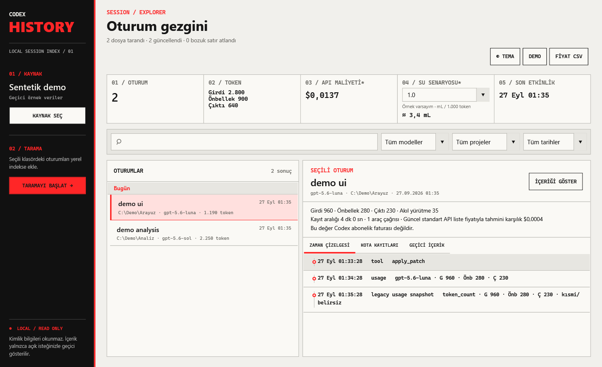
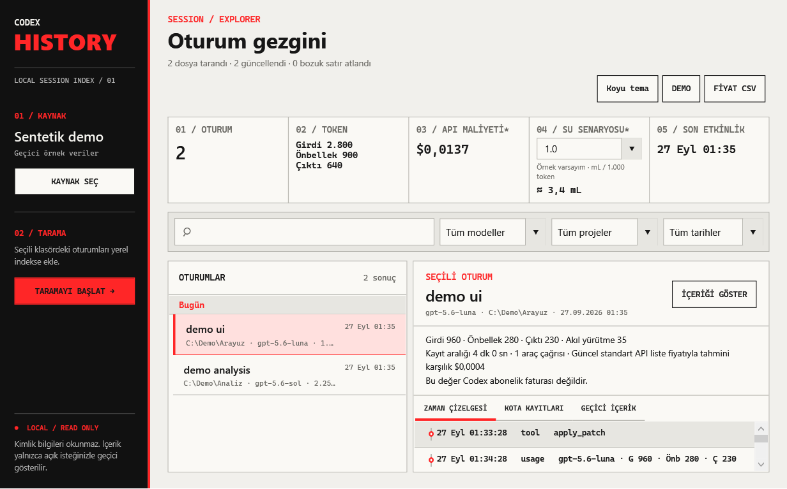

<div align="center">

# Codex History

### Your coding sessions, finally in view.

A local Windows companion for exploring Codex sessions, token usage and estimated API-equivalent costs.

[](https://github.com/Cemilcanoz/codex-history/actions/workflows/ci.yml)
[](#get-started)
[](LICENSE)

[Download](https://github.com/Cemilcanoz/codex-history/releases/latest) · [Türkçe](README.tr.md) · [Report a bug](https://github.com/Cemilcanoz/codex-history/issues/new?template=bug_report.yml) · [Contribute](CONTRIBUTING.md)

</div>


*Real application screenshots with synthetic demo data. The current interface is in Turkish.*

## Find the work behind the tokens

Codex session logs contain useful history, but reading JSONL files is a poor way to revisit your work. Codex History turns a folder you choose into a searchable, local session index.

- **Revisit a session.** Search titles, workspace paths and models; filter the session list and follow its event timeline.
- **Understand usage.** See input, cached input, output and reasoning tokens, tool calls and session duration.
- **Compare estimated costs.** Use a bundled, dated API price snapshot or import your own CSV. Unpriced models stay unknown or partial.
- **Inspect quota snapshots.** View primary and secondary limit information when it exists in the logs.
- **Try it without sharing your history.** Start with the built-in synthetic demo before selecting a real source.
- **Keep the index on your machine.** SQLite stores metadata; message contents and tool arguments are excluded from the index. Opt-in conversation previews stay in memory and are limited to 65,536 characters.

<details>
<summary>Light mode and compact window</summary>





</details>

## Get started

**Windows x64 · preview release · no account or API key required**

1. Open [Releases](https://github.com/Cemilcanoz/codex-history/releases/latest) and download the Windows portable ZIP.
2. Extract the ZIP, then run `CodexHistory.App.exe`. The portable build includes the .NET runtime.
3. Choose **DEMO** to explore synthetic sessions, or select your Codex home folder and click **TARA** to scan it.
4. Select a session to see its timeline and usage. Use search and model filters to narrow the list.

Select the parent folder containing `sessions/` and/or `archived_sessions/`. The default is `%USERPROFILE%\.codex`; if you set a custom Codex home, select that folder instead. Selecting `sessions/` itself will not scan its parent. The application does not scan automatically when it opens.

Windows may show a warning for an unsigned download. There is no signed installer or automatic update system yet.

## What the numbers mean

| Display | Meaning |
|---|---|
| Tokens | Usage reported by the local logs; incomplete logs can leave incomplete totals. Cached and reasoning tokens are subsets, not additional usage to add again. |
| Estimated cost | Approximate equivalent using API price entries. **It is not your Codex subscription bill.** |
| Quota | Historical snapshots present in a session, not a live account balance. |
| Water scenario | A configurable token-based scenario, **not measured water consumption**. The initial 1 mL / 1,000 tokens is an example assumption. |

The bundled price snapshot is dated **2026-09-22** and does not refresh from the network. A CSV with `model,effective_date,input_per_million,cached_per_million,output_per_million` can override it. See [price catalog details](docs/pricing.md), the [example CSV](samples/prices.example.csv) and [water methodology](docs/water-methodology.md).

## Local by design

The app reads the selected source folder without modifying its logs and keeps a rebuildable index outside the source. It does not use an API key, upload sessions or synchronize with a cloud service. Authentication files such as `auth.json` are excluded.

The index still contains metadata such as workspace paths and model names. Treat the index and your screenshots as personal data. Opt-in content preview is not a redaction tool. The default index is `%LOCALAPPDATA%\CodexHistory\index.db`.

## Build from source

Use Windows and a .NET 10 SDK compatible with [global.json](global.json).

```powershell
git clone https://github.com/Cemilcanoz/codex-history.git
cd codex-history
dotnet build CodexHistory.sln
dotnet test CodexHistory.sln
dotnet run --project src/CodexHistory.App
```

For the command-line indexer:

```powershell
dotnet run --project src/CodexHistory.Cli -- --help
dotnet run --project src/CodexHistory.Cli -- --source "C:\path\to\codex-home" --db "C:\path\outside-source\index.db"
```

Generate synthetic UI screenshots or a self-contained ZIP:

```powershell
./scripts/Run-Demo.ps1
./scripts/Publish-Portable.ps1 -Version 0.1.1
```

## Small, inspectable architecture

```text
WPF app / CLI → Core models → Infrastructure → local SQLite
                   ↑
           synthetic regression tests
```

The solution uses WPF and direct `Microsoft.Data.Sqlite` access, with no extra ORM or UI framework. Read the [architecture decisions](docs/decisions.md) and [contribution guide](CONTRIBUTING.md).

## Help shape the next release

Useful next steps include more log-format fixtures, English UI, signed distribution and clearer comparison views. These are roadmap items, not shipped features. A small reproduction using synthetic data is particularly welcome; please never attach real prompts, access tokens or authentication files to an issue.

Codex History is an **independent community project**, not an official OpenAI product. “Codex” identifies the logs it helps you inspect. Released under the [MIT license](LICENSE).
