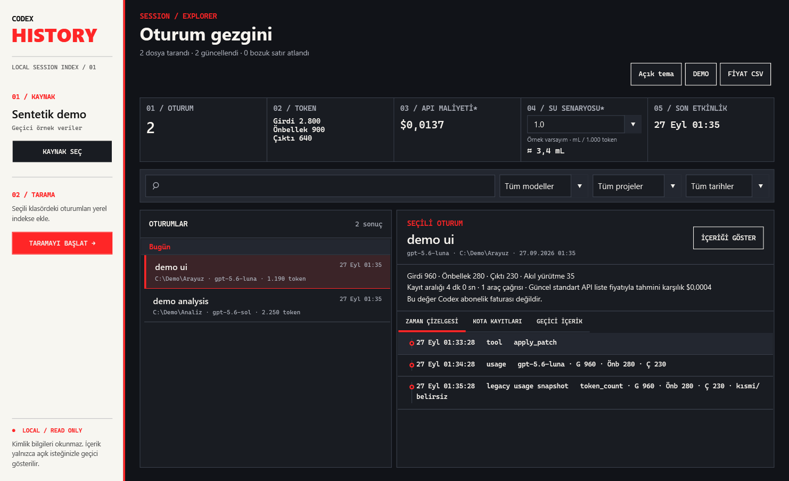

# Codex History

**Codex görev geçmişini, token kullanımını ve tahmini API maliyetini tek yerde gör.**

[İndir](https://github.com/Cemilcanoz/codex-history/releases/latest) · [English](README.md) · [Hata bildir](https://github.com/Cemilcanoz/codex-history/issues/new?template=bug_report.yml)



Windows için yerel bir geçmiş gezgini. Seçtiğin Codex oturum klasörünü salt okunur tarar; oturumları, modelleri, token kullanımını ve zaman çizelgesini aranabilir bir SQLite indeksine dönüştürür. Ekran görüntüleri gerçek uygulamadan, sentetik demo verileriyle alınmıştır.

## Başlat

1. [Releases](https://github.com/Cemilcanoz/codex-history/releases/latest) sayfasından Windows x64 portable ZIP'i indir.
2. ZIP'i çıkar ve `CodexHistory.App.exe` dosyasını aç. .NET kurulumuna gerek yoktur.
3. Önce **DEMO** ile dene. Gerçek kullanım için `sessions/` ve/veya `archived_sessions/` klasörlerini içeren üst klasörü seç (varsayılan `%USERPROFILE%\.codex`) ve **TARA** düğmesine bas.
4. Arama ve model filtresiyle geçmişi daralt; bir oturuma tıklayıp ayrıntısını incele.

Arayüz Türkçedir. Bu bir önizleme sürümüdür; imzalı kurulum paketi ve otomatik güncelleme henüz yoktur.

## Neler gösterir?

- Oturum listesi, tarih grupları, arama ve model filtresi.
- Girdi, önbellek, çıktı ve reasoning tokenları; süre ve araç çağrıları.
- Günlükte bulunan kota anlık görüntüleri ve olay zaman çizelgesi.
- Tarihli fiyat kataloğu ve kullanıcının CSV dosyasına göre tahmini API karşılığı.
- Açık/koyu tema ve isteğe bağlı, bellekte 65.536 karakterle sınırlanan konuşma önizlemesi.

**Maliyet Codex abonelik faturası değildir.** Fiyat kataloğu 22 Eylül 2026 tarihli yerel bir anlık görüntüdür, otomatik güncellenmez. Bilinmeyen modellerde sonuç bilinmiyor veya kısmi görünür. Kota verileri canlı hesap sorgusu değildir. Su alanı da gerçek tüketim ölçümü değil, değiştirilebilir katsayılı senaryodur. [Fiyat ayrıntıları](docs/pricing.md) · [Su metodolojisi](docs/water-methodology.md).

## Gizlilik

Günlükleri değiştirmez, oturumları yüklemez ve API anahtarı istemez. `auth.json` kapsam dışıdır. İndeks mesaj veya araç argümanı saklamaz; çalışma alanı yolları gibi metadata içerir. İsteğe bağlı içerik önizlemesi maskeleme sağlamaz. Varsayılan indeks: `%LOCALAPPDATA%\CodexHistory\index.db`.

## Geliştirme

Windows ve [global.json](global.json) ile uyumlu .NET 10 SDK gerekir.

```powershell
dotnet build CodexHistory.sln
dotnet test CodexHistory.sln
dotnet run --project src/CodexHistory.App
./scripts/Run-Demo.ps1
./scripts/Publish-Portable.ps1 -Version 0.1.1
```

Katkı için [CONTRIBUTING.md](CONTRIBUTING.md) dosyasını oku. Gerçek günlükleri, promptları veya kimlik bilgilerini issue'lara ekleme; sentetik örnekler kullan.

MIT lisanslı bağımsız bir topluluk projesidir. OpenAI'nin resmî ürünü değildir.
